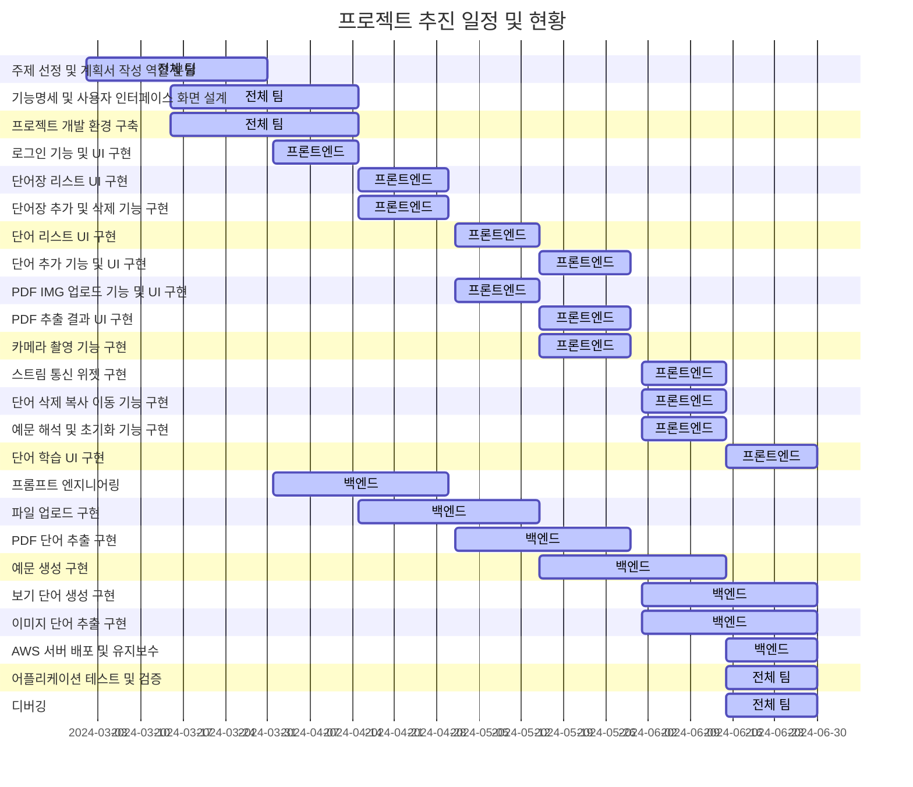

# 생성형 AI기반 PDF 인식 단어장 애플리케이션 VOCAI

## 프로젝트 개요
본 프로젝트는 2024 전남대학교 소프트웨어공학과 캡스톤 프로젝트로 진행 하였으며 안드로이드 환경에서 PDF 및 이미지 파일에서 단어를 추출하고, 단어장 관리 및 학습 기능을 제공하는 것을 목표로 한다.

**프로젝트 대상자**
1. 영어 본문을 번역기에 의존하지 않고 원문 그대로 이해하고자 하는 사용자
2. 논문, 소설, 기사 등 영어 원문을 그대로 읽고자 하는 사용자
3. 개인적으로 선택한 글을 학습하려는 사용자

## 프로젝트 아키텍처 설계

#### 유스케이스 다이어그램

###

## 팀구성 및 역할

#### 신수민
- 역할: [Flutter] 사용자 인터페이스 설계 및 애플리케이션 개발
- 담당 작업: 로그인 기능 구현, 단어장 리스트 UI 구현, 단어 추가 및 삭제 기능 구현 등
#### 최진서
- 역할: [Flutter] 사용자 인터페이스 설계 및 애플리케이션 개발
- 담당 작업: 파일 탐색 및 업로드 기능 구현, 직접 촬영 및 업로드 기능 구현 등
#### 허란
- 역할: [Flutter] 사용자 인터페이스 설계 및 애플리케이션 개발
- 담당 작업: 단어 추출 및 저장 기능 구현, 예문 해석 및 초기화 기능 구현 등
#### 박하민
- 역할: [SpringBoot] ChatGPT API 통신 및 REST API 서버 개발
- 담당 작업: 프롬프트 엔지니어링, 파일 업로드 구현, PDF 및 이미지 단어 추출 구현 등
#### 송대철
- 역할: [SpringBoot] ChatGPT API 통신 및 REST API 서버 개발
- 담당 작업: 예문 생성 구현, 보기 단어 생성 구현, 서버 배포 및 유지보수 등

### 프로젝트 일정 간트차트

### 프로젝트 기능 구현

**로그인 기능**

| 로그인 화면 | ID 입력 | PWD 입력 | 입력 오류 알림 |
|------|------|------|------|
|  |  |  |  |

---

**단어장 추가 및 삭제 기능**

| 단어장 목록 화면 | 단어장 생성 | 단어장 삭제(슬라이드) | 단어장 삭제(확인) |
|------|------|------|------|
|  |  |  |  |

---

**파일 탐색 및 업로드 기능**

| 업로드 화면 | 파일 탐색 | PDF 선택 시 화면 | IMG 선택 시 화면 |
|------|------|------|------|
|  |  |  |  |

---

**직접 촬영 및 업로드 기능**

| 업로드 화면(카메라 버튼) | 카메라 열기 | 카메라 촬영 | 촬영 이미지 적재 |
|------|------|------|------|
|  |  |  |  |

---

**단어 추출 및 저장 기능**

| 추출 결과 화면 | 단어 선택 | 단어장 선택 | 저장 확인 |
|------|------|------|------|
|  |  |  |  |

---

**예문 해석 및 초기화 기능**

| 예문 보기 화면 | 예문 해석 | 예문 초기화 | 새로운 예문 해석 |
|------|------|------|------|
|  |  |  |  |

---

**단어 삭제 복사 이동 기능**

| 단어 목록 화면 | 단어 삭제 | 단어 복사 | 단어 이동 |
|------|------|------|------|
|  |  |  |  |

---

**단어 직접 추가 기능**

| 단어 추가 화면 | 단어 뜻 입력 | 예문 입력 | 저장 확인 |
|------|------|------|------|
|  |  |  |  |

---

**단어 학습 기능 (1)**

| 학습 페이지 도입부 화면 | 문제 예시 보기 | 단어장 선택 | 단어장 적재 확인 |
|------|------|------|------|
|  |  |  |  |

---

**단어 학습 기능 (2)**

| 단어 학습 화면 | 보기 선택 (1개 제한) | 정답 및 뜻 확인 | 다음 단어 학습(슬라이드) |
|------|------|------|------|
|  |  |  |  |

## 시연 영상

## 향후 과제
**AI 답변에 검증기능 추가**
현재 앱의 답변은 ai의 실수가 고려되어 있지 않으므로 pdf로부터 단어 추출 후, 영어사전을 검색하고 주려고 했던 문맥상 의미와 가장 가까운 뜻을 제공하는 기능을 추가할 수 있다. 이와 같은 방법으로 사용자에게 정확한 정보의 전달을 기대할 수 있을 것이다.

**다양한 언어로의 확장**
다른 대규모 언어 모델 (LLM) 기반의 서비스를 제공하며 자연어처리를 하기 때문에 추후 영어가 아닌 다른 언어로의 유연한 확장성을 기대할 수 있을 것이다.

**예문 생성 기능의 확장**
PDF 텍스트 추출 및 단어와 예문 제공 기능 외에도, 사용자가 제공하는 다양한 상황이 반영된 예문 생성 기능을 추가하여 여러 문맥에서 단어의 사용방법을 학습할 수 있을 것이다.

**수준별 학습 기능 추가**
학습 페이지에서 문장구조의 수준과 학습 단어의 난이도를 고려하며, 유럽 언어 표준등급(CEFR)을 기반으로 예문과 선지를 구성하도록 지원할 예정이다.

**결제 및 구독 서비스 추가**
또한, 결제 및 구독 기능을 추가하여 계정 별 온라인 저장 서비스를 지원하고, 서비스를 구독제로 판매할 예정이다.

**학습 기반 사용자 수준 진단**
사용자가 학습한 단어정보를 기반으로 사용자가 CEFR 기준으로 어느 수준까지 학습했는지에 대한 통계 데이터를 시각적으로 제공할 예정이다.
